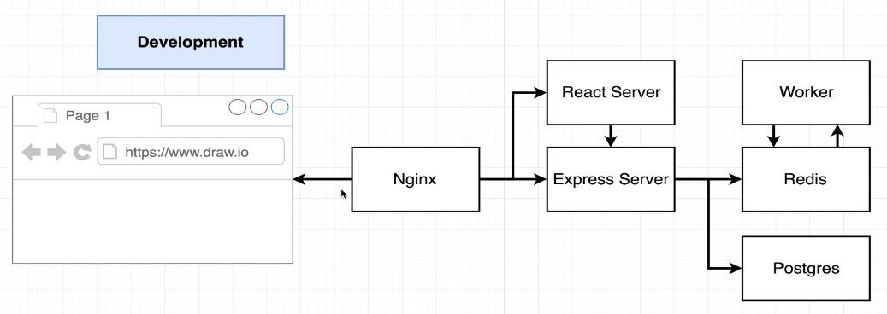

# Docker and Kubernetes: The Complete Guide

Course notes from Stephen Grider's lectures on Udemy.com

## contents

- [Docker and Kubernetes: The Complete Guide](#docker-and-kubernetes-the-complete-guide)
  - [contents](#contents)
  - [Section 1: Dive Into Docker](#section-1-dive-into-docker)
  - [Section 2: Manipulating Containers with the Docker Client](#section-2-manipulating-containers-with-the-docker-client)
  - [Section 3: Building Custom Images Through Docker Server](#section-3-building-custom-images-through-docker-server)
  - [Section 4: Making Real Projects](#section-4-making-real-projects)
  - [Section 5: Docker Compose - Multiple Containers](#section-5-docker-compose---multiple-containers)
  - [Section 6: Creating a Production Grade Workflow](#section-6-creating-a-production-grade-workflow)
    - [course example](#course-example)
      - [tests](#tests)
      - [build and run](#build-and-run)
  - [Section 7: Continuous Integration and Deployment with AWS](#section-7-continuous-integration-and-deployment-with-aws)
    - [Vite (vanilla js) -\> GitHub testing and deployment -\> AWS Elastic Beanstalk](#vite-vanilla-js---github-testing-and-deployment---aws-elastic-beanstalk)
  - [Section 8: Building a Multi-Container Application](#section-8-building-a-multi-container-application)
    - [course example - "Fibonacci Overkill"](#course-example---fibonacci-overkill)
      - [development flow](#development-flow)
      - [development architecture](#development-architecture)
      - [application logic](#application-logic)
      - [Service 1: NodeJS Worker `worker`](#service-1-nodejs-worker-worker)
      - [Service 2: Express API `server`](#service-2-express-api-server)

## Section 1: Dive Into Docker

- **image:** A read-only template that contains all the necessary components—such as application code, runtime, system tools, libraries, and settings—to run a software application within a container. Think of it as a cookie cutter.
- **container:** A lightweight, standalone, executable package that includes everything needed to run an application, such as the code, runtime, system tools, libraries, and configuration files. An instance of an image. Think cookie.

## Section 2: Manipulating Containers with the Docker Client

```bash
  $ docker run hello-world            # verify installation
  $ docker version                    # info
  $ docker run <image>                # create & run container from an image, download if needed
  $ docker run <image> <command>      # override the default image command
  $ docker run busybox echo "hello"   # example
  $ docker ps                         # list running containers
  $ docker container ls               # same as `docker ps`
  $ docker ps -a                      # list all containers
  $ docker create <image>             # step 1: create a new image
  $ docker start <container>          # step 2: start new instance from image
  $ docker run <image>                # combines steps 1 & 2
  $ docker start -a <container>       # start and attach to a stopped container
  $ docker run -it <image> sh         # create, start, and attach w/ sh console shell
  $ docker run -it ubuntu bash        # create, start, attach to a ubuntu bash console shell
  $ docker exec -it <container> <cmd> # attach to a running container with command
  $ docker exec -it <container> bash  # example command prompt in a running container
  $ docker stop <container>           # stop container via SIGTERM (preferred)
  $ docker kill <container>           # kill container via SIGKILL
  $ docker system prune               # deletes stopped containers
  $ docker logs <container>           # view console output
  $ docker image ls                   # view downloaded/created local images
  $ docker images                     # same as `docker image ls`
```

## Section 3: Building Custom Images Through Docker Server

Custom images are built with a `Dockerfile`:

```Dockerfile
# Use an existing docker image as a base
FROM alpine

# Download and install a dependency
RUN apk add --update redis

# Tell the image what command to run when it starts
CMD ["redis-server"]
```

Building the image (command executed from the same directory as `Dockerfile`). Docker will cache dependencies for faster rebuilds. By convention, the tag is prefixed with your Docker ID:

```bash
  $ docker build .
  $ docker build -t sfdeloach/redis:latest . # tag images with name and version
```

Another (nonsensical) example:

```Dockerfile
# Use an existing image of Fedora
FROM fedora

# Download nodejs and gcc with its package manager
RUN dnf update -y
RUN dnf install -y nodejs
RUN dnf install -y gcc

# Run ping when the container starts, notice the string array format
CMD ["ping","archlinux.org"]
```

## Section 4: Making Real Projects

See `Dockerfile` in `04-simple-server` for an example of how to build a nodeJS express server image using a Dockerfile. Take notice of the following:

- specify a tag with a base image for specificity
- set a working directory inside your container, `/usr/src/app` is a conventional location for most containerized applications
- copy build files from your local machine into your container
- map network ports to your container during the `run` or `create` command
- put thought into the order of commands in the Dockerfile to minimize rebuild times

**NOTE:** While it is possible to place multiple services inside a container, however, this is not good practice. Each service should be placed in its own container so that there is greater flexibility when scaling.

## Section 5: Docker Compose - Multiple Containers

Up to this point, we have used the Docker CLI to work with containers. As projects grow, this becomes clunky. [Docker Compose](https://docs.docker.com/compose/) is used in industry to manage complexity. Docker Compose defines and runs multi-container applications and streamlines the development and deployment experience.

Docker Compose sets up a single network for your application(s) by default, adding each container for a service to the default network. Containers on a single network can reach and discover every other container on the network. External connections must be explicitly defined.

A `compose.yml` is used by Docker Compose to create containers.

The contents of a simple `compose.yml` file:

```yml
# services define a resource that can be scaled and managed independently
services:
  # first container, this name becomes its discoverable hostname on the default network
  redis-server:
    # image available on docker hub
    image: "redis:8.2-alpine"
  # second container w/ host name 'node-app'
  node-app:
    # restart policies include "no" (default), always, on-failure, and unless-stopped
    restart: always
    # looks for the Dockerfile to build this image
    build: .
    # must explicitly define a port if external connection desired
    ports:
      # maps port 80 on the local machine to port 3000 in the container instance
      - "80:3000"
```

```bash
  $ docker compose up         # create and start containers
  $ docker-compose up -d      # detached mode, run in background
  $ docker-compose up --build # build images before starting
  $ docker compose ps         # list containers
  $ docker compose stop       # stop services
  $ docker compose start      # start services
  $ docker compose down       # stop and remove containers
```

See two examples of multi-container applications in `05-docker-compose`:

- A simple redis backend and express js api
- A slightly more complicated postgres db, adminer db manager, and fastAPI api

When working with volumes, some helpful commands include:

```bash
 $ docker volume ls          # list volumes
 $ docker volume prune       # remove unused local volumes
 $ docker volume rm <volume> # remove one or more volumes
```

## Section 6: Creating a Production Grade Workflow

### course example

The workflow is a cycle:


In this section, the workflow will look like this:


Create a new react app, run the out of the box test, and build the application to make sure the application works:

```bash
  $ create-react-app my-app
  $ cd my-app
  $ npm start
  $ npm run test
  $ npm run build
```

Note that the preceding commands created the `node_modules` directory, which will contain a significant number of directories and files. For the purpose of demonstrating docker volumes in a later step, remove the `node_modules` directory:

```bash
  $ rm -rf node_modules
```

Remaining in the `frontend` directory, create a development Dockerfile:

```bash
  $ touch Dockerfile.dev
```

This file will use the `npm run start` command during development. Later we will create the conventional `Dockerfile` that will use the `npm run build` command for production. The contents of the `Dockerfile.dev` will provide the setup of our development container:

```Dockerfile
## Dockerfile.dev
FROM node:lts-alpine3.22

# Set working directory
WORKDIR /usr/src/app

# Install app dependencies
COPY package*.json ./
RUN npm install

# Bundle app source
COPY . .

# Start development server
CMD ["npm", "start"]
```

Running `docker build .` will look for the default `Dockerfile`, which does not exist at this time. The build file must be explicitly defined using the `-f` flag:

```bash
  $ docker build -t sfdeloach/react-dev:latest -f Dockerfile.dev .
```

Options added to the run command allow bookmarks and mappings to a volume. This will allow the react development server the ability to detect changes made locally. Notice that both bookmarks and mappings use the same `-v` flag. The only difference is the colon, which is a similar syntax used earlier to map a local port to a container's port:

```bash
  $ docker run -p 3000:3000 -v usr/src/app/node_modules -v $(pwd):/usr/src/app <image>
  $ ######################## ^ bookmark ################ ^ mapping ###################
```

This example is purposefully designed to demonstrate the use of bookmarks and volumes. In this example, we deleted the `node_modules` directory locally, which contained scripts needed to start our development environment. Mapping the contents of our local working directory will not provide it since it no longer exists. However, recall that the command `npm install` was run inside our container during the build. This installed a copy of `node_modules` in the container. The bookmark tells the container to look inside its own file system for any references to the `node_modules` directory. This bookmark is intentionally place before the mapping.

As an aside, a simpler development container could be created. Only the `package.json` file would be needed to run the initial npm script and only a mapping to the working directory is needed if `node_modules` was not removed:

```Dockerfile
FROM node:lts-alpine3.22
WORKDIR '/usr/src/app'
COPY package.json .
CMD ["npm", "start"]
```

Build the image as shown above, then run with only the mapping:

```bash
  $ docker run -p 3000:3000 -v $(pwd):/usr/src/app <image>
```

The container would be able find `node_modules` on the local machine using this approach. For a development container, it may be the better practice to rely on dependencies installed inside the container. This may be especially true for a Python virtual environment. Returning to the example above that uses a bookmark for the `node_modules` directory, the run command is rather lengthy. [Docker Compose](https://docs.docker.com/compose) to the rescue!

```bash
  $ touch compose.yml
```

The contents of `compose.yml`:

```yml
services:
  web:
    build:
      # sets the directory to the current folder
      context: .
      # unconventional name, must be explicitly defined
      dockerfile: Dockerfile.dev
    ports:
      - "3000:3000"
    volumes:
      # bookmark, look inside the container, no ":" is used
      - /usr/src/app/node_modules
      # mapping local directory to the container's /app directory
      - .:/usr/src/app
```

#### tests

To run tests, override the run command as demonstrated before:

```bash
  $ docker run -it <image> npm run test
```

Running the command as demonstrated above causes a small problem. A new container is created with its own filesystem, therefore, it is unable to detect any live changes to the source. There are two solutions, each with advantages and disadvantages. The first solution uses the `exec` command on the running running container:

```bash
  $ docker exec -it <container> npm run test
```

The drawback on this approach requires a second step and keeping the container ID in mind. The second solution is to setup an additional service in `compose.yml`:

```yml
---
(append the service 'tests' to existing file...)
---
tests:
  build:
    context: .
    dockerfile: Dockerfile.dev
  # Override the default command to run tests
  volumes:
    - /usr/src/app/node_modules
    - .:/usr/src/app
  command: ["npm", "run", "test"]
```

The test results update as expected and they are conveniently started in its own container, however, the terminal is not attached to the standard input, which does not allow for an interactive experience. Consider which option may be best for your current testing objectives.

#### build and run

To this point in the exercise, we have setup a development and testing container. Now it is time to move to production. This will be accomplished in a multi-step build process. In this case it will occur in one `Dockerfile` that specifies two phases: **BUILD** and **RUN**

The _build phase_ will use `node:lts-alpine3.22` as a base image and install all dependencies in order to build the react app.

The _run phase_ will use `nginx` as a base image, copy over the results of the _build phase_ and start the Nginx server.

The multi phase `Dockerfile`:

```Dockerfile
# Multi-stage Dockerfile for Production
FROM node:lts-alpine3.22 AS build

# Set working directory
WORKDIR /usr/src/app

# Install app dependencies
COPY package*.json ./
RUN npm install

# Bundle app source
COPY . .

# Build the app
RUN npm run build

# Produce a lean production image
FROM nginx:1.29.2-alpine

# Copy built app from the build stage
COPY --from=build /usr/src/app/build /usr/share/nginx/html
```

Note the following:

- it is not necessary to install all the dev dependencies in our production container
- in fact, node is not needed at all in production, we are only serving static content
- build stages can be named to increase readability: `FROM node:lts-alpine3.22 AS builder`
- no `RUN` command is necessary for nginx, the server is enabled by default

We are now ready to build our production image and run it:

```bash
  $ docker build -t sfdeloach/nginx-server:latest .
  $ docker run -p 8080:80 <image>
```

## Section 7: Continuous Integration and Deployment with AWS

The course uses Travis CI for automated workflows. The following uses GitHub Actions instead.

### Vite (vanilla js) -> GitHub testing and deployment -> AWS Elastic Beanstalk

See GitHub repository `sfdeloach/my-website` for the code:

1. Using [Vite](https://vite.dev/) to build a simple Vue frontend with tests.
2. Setup a git develop branch along with the main branch.
   - Only develop branches are committed locally, all updates to main are made through a pull request.
3. Setting up a development container that provides live updates (map src folder to container).
   - Remember to use the `--host` flag for the vite development server to be exposed outside the container.
   - Using volumes and bookmarks across local and container environments.
   - Delete the contents of the local node_modules directory (directory still exists, but is empty) and rely on dependencies inside the container.
4. Setting up a docker compose file, using both of the dev and testing containers built earlier for local development.
   - Setting up a testing container using the same image for development with an overriding command.
5. Using [GitHub Actions](https://docs.github.com/en/actions), run unit tests when new code is pushed to the repository.
   - see `/.github/workflows/frontend-unit-tests.yml`
6. Setting up a production container `Dockerfile` via multi-stage builds using Nginx server.
7. Extending GitHub actions for deployment to AWS Elastic Beanstalk.
   - see [beanstalk-deploy](https://github.com/marketplace/actions/beanstalk-deploy)
   - see `/.github/workflows/deploy-aws-eb.yml`
   - adding repository secrets for AWS IAM-created user:
     - `AWS_ACCESS_KEY_ID`
     - `AWS_SECRET_ACCESS_KEY`
     - `AWS_S3_BUCKET`

## Section 8: Building a Multi-Container Application

### course example - "Fibonacci Overkill"

An "over the top" web application with more services than it requires for calculating Fibonacci numbers. The purpose is to demonstrate how to build a more complex multi-container application. Project repo located at `sfdeloach/fibi-overkill`.

#### development flow

- User enters a number
- Nginx server determines if the request is for the UI or the API
- If for the UI, Nginx serves the UI
- If for the API, route to the Express Server, then
  - Store number in Postgres database
  - Lookup number in Redis for previous calculation
  - If already calculated, return the cached result
  - Otherwise, send request to a Nodejs worker to calculate result and save the result when it returns
  - Update UI with data from Postgres ("values I have seen") and Redis ("calculated values")

#### development architecture



#### application logic


#### Service 1: NodeJS Worker `worker`

1. Dependencies: [nodemon](https://www.npmjs.com/package/nodemon), [redis](https://www.npmjs.com/package/redis) client
2. Scripts: start and dev
3. Keys: kept in a separate file, read from env vars
4. Recursive fibonacci function (purposefully slow)
5. Subscribe on insert events, calculate value, set result in redis
6. Setup redis client, take note of the need of a duplicate client for [subscribing](https://github.com/redis/node-redis/blob/master/docs/pub-sub.md)

#### Service 2: Express API `server`

1. Dependencies: [express](https://www.npmjs.com/package/express), [pg](https://www.npmjs.com/package/pg), [redis](https://www.npmjs.com/package/redis), [cors](https://www.npmjs.com/package/cors), [nodemon](https://www.npmjs.com/package/nodemon), [body-parser](https://www.npmjs.com/package/body-parser)
2. Scripts: start and dev
3. Keys: kept in a separate file, read from env vars
   1. Redis: host and port
   2. Pg: user, host, database, password, port
4. Use pool connections for postgres
5. Create initial table of values in database if it does not exist
6. Setup redis client, same as the `worker` service above, a duplicate client is needed to [publish](https://github.com/redis/node-redis/blob/master/docs/pub-sub.md).
7. Define at least four routes:
   1. Test route that simply verifies the API is receiving requests
   2. All values from postgres
   3. All values from redis
   4. On user submission of a number, validate input, update value log in postgres, return answer if it exists, if not, send (publish) the task to the `worker` and return a busy signal

